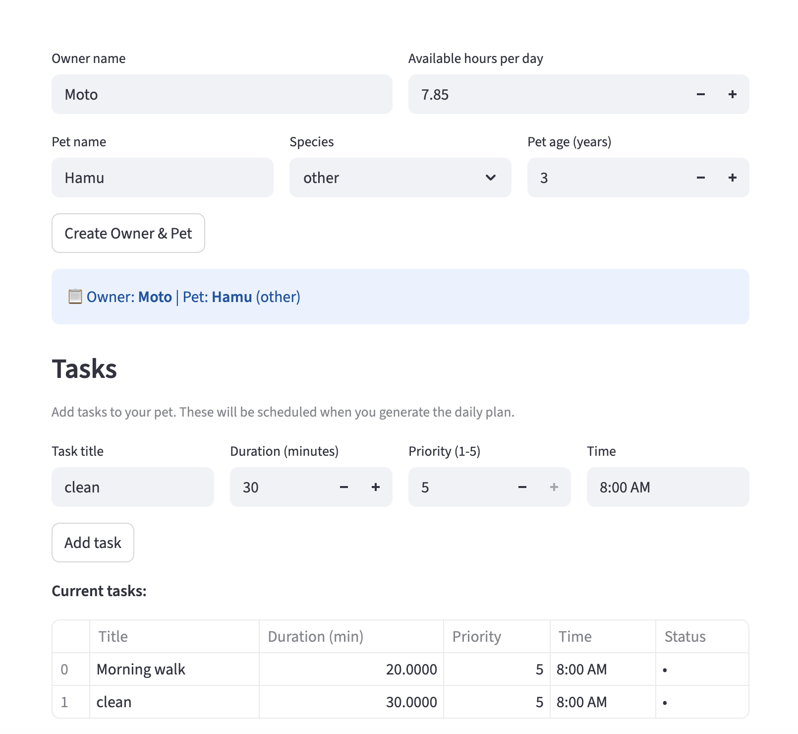
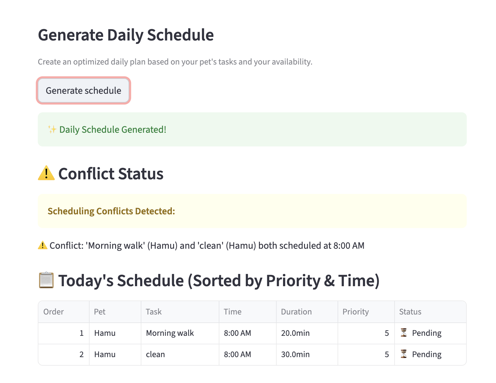

# PawPal+ (Module 2 Project)

You are building **PawPal+**, a Streamlit app that helps a pet owner plan care tasks for their pet.

## Scenario

A busy pet owner needs help staying consistent with pet care. They want an assistant that can:

- Track pet care tasks (walks, feeding, meds, enrichment, grooming, etc.)
- Consider constraints (time available, priority, owner preferences)
- Produce a daily plan and explain why it chose that plan

Your job is to design the system first (UML), then implement the logic in Python, then connect it to the Streamlit UI.

## What you will build

Your final app should:

- Let a user enter basic owner + pet info
- Let a user add/edit tasks (duration + priority at minimum)
- Generate a daily schedule/plan based on constraints and priorities
- Display the plan clearly (and ideally explain the reasoning)
- Include tests for the most important scheduling behaviors

## Features

### Owner & Pet Management

- Create and manage pet owner profiles with available time per day
- Add multiple pets to an owner with detailed info (name, species, breed, age, care notes)
- Auto-assigned pet IDs for easy tracking and retrieval

### Task Creation & Management

- Create pet care tasks with essential properties: title, category, duration, priority, and preferred time
- Update task attributes dynamically
- Mark tasks complete with automatic timestamp tracking
- View task summaries with pet name and completion status

### Smart Scheduling & Sorting

- **Priority-Based Sorting**: Sort tasks by priority level (higher priority = earlier in day)
- **Time-Based Ordering**: Tasks scheduled at the same priority are ordered chronologically by preferred time
- Generate daily task plan with automatic sorting by priority and time

### Task Filtering

- **Filter by Pet**: View all tasks for a specific pet (case-insensitive search)
- **Filter by Status**: Separate pending and completed tasks
- Get comprehensive task lists across all pets for an owner

### Recurring Tasks

- Support for daily and weekly recurring tasks with automatic recurrence pattern tracking
- Automatically generate next task occurrence when a recurring task is completed
- Copy task properties (title, category, duration, priority, time) to next occurrence
- Track due dates and maintain completion history

### Conflict Detection

- Automatically detect when multiple tasks are scheduled at the same time
- Generate clear, detailed warning messages for each conflict
- Display pet names and task titles in conflict alerts for easy identification

### Streamlit User Interface

- Clean, beginner-friendly web interface for all features
- Interactive forms to set up owner/pet info and add tasks
- One-click schedule generation with polished dataframe display
- Real-time conflict warnings with visual alerts
- Organized sections for each phase of the workflow (setup → tasks → scheduling)

## Getting started

### Setup

```bash
python -m venv .venv
source .venv/bin/activate  # Windows: .venv\Scripts\activate
pip install -r requirements.txt
```

### Suggested workflow

1. Read the scenario carefully and identify requirements and edge cases.
2. Draft a UML diagram (classes, attributes, methods, relationships).
3. Convert UML into Python class stubs (no logic yet).
4. Implement scheduling logic in small increments.
5. Add tests to verify key behaviors.
6. Connect your logic to the Streamlit UI in `app.py`.
7. Refine UML so it matches what you actually built.

## Smarter Scheduling

The PawPal+ scheduler now includes several smarter scheduling features. Tasks can be sorted by time, filtered by pet name or completion status, and checked for simple scheduling conflicts. The system also supports recurring daily and weekly tasks by automatically creating the next occurrence when a recurring task is completed.

## Testing PawPal+

Run the automated test suite with:

```bash
python3 -m pytest
```

The current tests cover core PawPal+ system behavior, including task sorting, recurring daily task creation, conflict detection for tasks scheduled at the same time, and other foundational task and pet interactions.

Confidence Level: ★★★★★

### Demo

<a href="pawpal_demo1.png" target="_blank"></a>

<a href="pawpal_demo2.png" target="_blank"></a>
