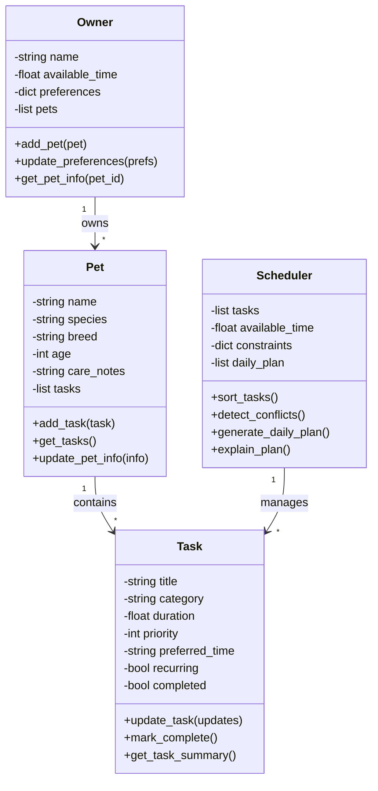

# PawPal+ Class Diagram

```mermaid
classDiagram
    class Owner {
        -string name
        -float available_time
        -dict preferences
        -list pets
        +add_pet(pet)
        +update_preferences(prefs)
        +get_pet_info(pet_id)
    }

    class Pet {
        -string name
        -string species
        -string breed
        -int age
        -string care_notes
        -list tasks
        +add_task(task)
        +get_tasks()
        +update_pet_info(info)
    }

    class Task {
        -string title
        -string category
        -float duration
        -int priority
        -string preferred_time
        -bool recurring
        -bool completed
        +update_task(updates)
        +mark_complete()
        +get_task_summary()
    }

    class Scheduler {
        -list tasks
        -float available_time
        -dict constraints
        -list daily_plan
        +sort_tasks()
        +detect_conflicts()
        +generate_daily_plan()
        +explain_plan()
    }

    Owner "1" --> "*" Pet : owns
    Pet "1" --> "*" Task : contains
    Scheduler "1" --> "*" Task : manages
```
